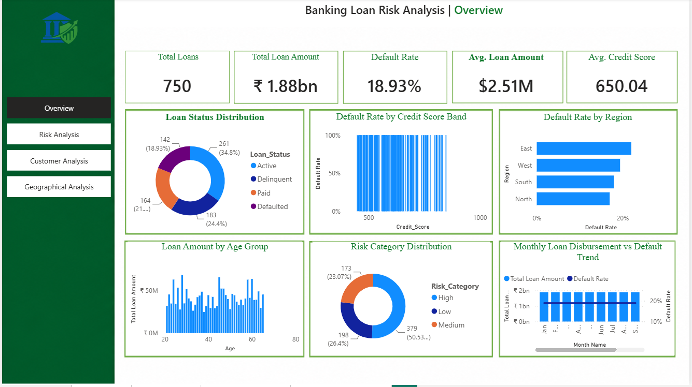

# 🏦 Banking Loan Risk Analysis Dashboard

> An end-to-end banking analytics project built using **Power BI, SQL, Excel, Power Query, and DAX** to analyze loan portfolio performance, customer behavior, credit risk, geographic distribution, and monthly trends.

---

## 📊 Dashboard Preview

### 🏠 Overview Dashboard



The Overview dashboard provides a high-level view of the banking loan portfolio, including total loans, total loan amount, default rate, average loan amount, average credit score, risk distribution, regional performance, and monthly loan trends.

---


# 📌 Project Overview

The **Banking Loan Risk Analysis Dashboard** is a professional business intelligence project designed to help banking teams monitor loan portfolio performance and identify potential credit risks.

The project transforms raw loan-level data into an interactive Power BI dashboard using Power Query for data preparation, DAX for calculations, SQL for analysis, and Excel for data validation and exploration.

The dashboard helps answer questions such as:

- How large is the current loan portfolio?
- What is the overall default rate?
- Which customers are high risk?
- Which credit score bands have the highest default rates?
- Which regions have the highest loan amounts?
- Which regions have the highest default rates?
- How does loan activity change month by month?
- Which customer segments contribute the most to the portfolio?
- How are loan disbursements and collections performing?

---

# 🎯 Project Objectives

- Analyze overall loan portfolio performance.
- Monitor total loan amount and loan volume.
- Identify defaulted and high-risk loans.
- Analyze customers by age, gender, income, and credit score.
- Analyze credit score bands and their relationship with default.
- Compare loan performance across regions and states.
- Analyze loan purposes and risk categories.
- Monitor monthly loan disbursement trends.
- Analyze customer segments.
- Identify high-value customers.
- Create an interactive banking management dashboard.
- Provide actionable business insights for credit risk management.

---

# 🛠️ Tools & Technologies

| Tool | Purpose |
|---|---|
| **Power BI** | Dashboard development, visualization, reporting |
| **Power Query** | Data cleaning and transformation |
| **DAX** | Measures, calculated columns, KPIs |
| **SQL** | Data analysis and validation |
| **Excel** | Data inspection, validation and exploratory analysis |
| **GitHub** | Project documentation and version control |

---

# 📂 Project Structure

```text
Banking-Loan-Risk-Analysis/
│
├── Dataset/
│   └── Banking_Loan.csv
│
├── PowerBI/
│   └── Banking_Loans.pbix
│
│
├── Screenshots/
│   ├── Overview.png
│ 
│
└── README.md
```

---

# 📊 Dataset

The project uses a realistic banking loan dataset containing **700+ loan records**.

The dataset contains information related to customers, loans, credit risk, branches, regions, loan purposes, income, and repayment performance.

## Key Columns

| Column | Description |
|---|---|
| Customer_ID | Unique customer identifier |
| Loan_ID | Unique loan identifier |
| Application_Date | Loan application date |
| Disbursement_Date | Loan disbursement date |
| Age | Customer age |
| Gender | Customer gender |
| Region | Customer region |
| State | Customer state |
| Branch | Bank branch |
| Loan_Purpose | Purpose of loan |
| Loan_Amount | Loan amount |
| Interest_Rate | Loan interest rate |
| Credit_Score | Customer credit score |
| Debt_To_Income_Ratio | Customer DTI ratio |
| Annual_Income | Customer annual income |
| Loan_Term | Loan repayment period |
| Loan_Status | Current loan status |
| Risk_Category | Customer risk classification |
| Employment_Status | Employment category |
| Collateral_Value | Collateral value |
| Monthly_Payment | Monthly repayment |
| Repayment_Status | Repayment performance |

---

# 🔄 Power Query Data Preparation

The raw dataset was prepared in **Power BI Power Query**.

## Main Steps

1. Import the CSV dataset.
2. Promote the first row as headers.
3. Check column names.
4. Remove unnecessary columns.
5. Rename columns where required.
6. Change data types.
7. Handle missing values.
8. Remove duplicate records.
9. Standardize text values.
10. Validate numeric fields.
11. Create age groups.
12. Create income ranges.
13. Create credit score bands.
14. Create risk categories where required.
15. Create date-related fields.
16. Validate the cleaned dataset.
17. Load the transformed data into the Power BI model.

---

# 🧱 Data Model

The Power BI model uses a structured fact and date-table design.

```text
Fact_Loan
    │
    ├── Customer_ID
    ├── Loan_ID
    ├── Loan_Amount
    ├── Credit_Score
    ├── Loan_Status
    ├── Risk_Category
    ├── Region
    ├── State
    └── Disbursement_Date
             │
             ▼
          Dim_Date
```

`Fact_Loan` contains loan-level records.

`Dim_Date` is used for:

- Month analysis
- Year analysis
- Monthly trends
- Date filtering
- Time intelligence
- Chronological sorting

---

# 🧮 DAX Measures

## Total Loan Amount

```DAX
Total Loan Amount =
SUM(Fact_Loan[Loan_Amount])
```

## Total Loans

```DAX
Total Loans =
DISTINCTCOUNT(Fact_Loan[Loan_ID])
```

## Total Customers

```DAX
Total Customers =
DISTINCTCOUNT(Fact_Loan[Customer_ID])
```

## Average Loan Amount

```DAX
Avg Loan Amount =
AVERAGE(Fact_Loan[Loan_Amount])
```

## Defaulted Loans

```DAX
Defaulted Loans =
CALCULATE(
    [Total Loans],
    Fact_Loan[Loan_Status] = "Defaulted"
)
```

## Default Rate

```DAX
Default Rate =
DIVIDE(
    [Defaulted Loans],
    [Total Loans],
    0
)
```

## High Risk Loans

```DAX
High Risk Loans =
CALCULATE(
    [Total Loans],
    Fact_Loan[Risk_Category] = "High"
)
```

## Default Amount

```DAX
Default Amount =
CALCULATE(
    [Total Loan Amount],
    Fact_Loan[Loan_Status] = "Defaulted"
)
```

## Collections Amount

If the dataset has a real collections column:

```DAX
Collections Amount =
SUM(Fact_Loan[Collections_Amount])
```

For a portfolio demonstration using paid loans:

```DAX
Collections Amount =
CALCULATE(
    [Total Loan Amount],
    Fact_Loan[Loan_Status] = "Paid"
)
```

## Collection Rate

```DAX
Collection Rate =
DIVIDE(
    [Collections Amount],
    [Total Loan Amount],
    0
)
```

---

# 🏷️ Credit Score Band

```DAX
Credit Score Band =
SWITCH(
    TRUE(),
    Fact_Loan[Credit_Score] < 600, "300-599",
    Fact_Loan[Credit_Score] < 700, "600-699",
    Fact_Loan[Credit_Score] < 750, "700-749",
    "750-850"
)
```

This calculated column groups customers into credit score bands for risk comparison.

---

# 📅 Date Table

```DAX
Dim_Date =
CALENDAR(
    MIN(Fact_Loan[Disbursement_Date]),
    MAX(Fact_Loan[Disbursement_Date])
)
```

Additional columns:

```DAX
Year =
YEAR(Dim_Date[Date])
```

```DAX
Month Number =
MONTH(Dim_Date[Date])
```

```DAX
Month Name =
FORMAT(Dim_Date[Date], "MMM")
```

```DAX
Month Year =
FORMAT(Dim_Date[Date], "MMM YY")
```

```DAX
Day Name =
FORMAT(Dim_Date[Date], "ddd")
```

```DAX
Day Number =
WEEKDAY(Dim_Date[Date], 2)
```

Sort `Month Name` by `Month Number` and `Month Year` by a numeric year-month sort column.

---

# 📑 Dashboard Pages

## 1 Overview Dashboard

### KPIs

- Total Loans
- Total Loan Amount
- Default Rate
- Average Loan Amount
- Average Credit Score
- High Risk Loans

### Visuals

- Loan Status Distribution
- Default Rate by Credit Score Band
- Default Rate by Region
- Loan Amount by Age Group
- Risk Category Distribution
- Monthly Loan Disbursement vs Default Trend
- High Risk Customers
- Key Business Insights

---

## 2  Customer Analysis

### KPIs

- Total Customers
- New Customers
- Repeat Customers
- Average Loan Amount
- Good Customers %
- High Risk Customers

### Visuals

- Customers by Age Group
- Customers by Gender
- Customers by Region
- Top States by Customers
- Customers by Income Range
- Customer Segmentation
- Customer Tenure
- Credit Score Distribution
- Top 10 High Value Customers

### Customer Segments

```text
Prime
Near Prime
Sub Prime
Deep Sub Prime
```

---

## 3 Geographic Analysis

### Visuals

- Loan Amount by Region
- Loan Count by Region
- Default Rate by Region
- Loan Amount by State
- Default Rate by State
- Loan Trend by Region
- Geographic Loan Distribution

### Business Questions

- Which region has the highest loan amount?
- Which region has the highest default rate?
- Which states have the highest loan concentration?
- Where is credit risk concentrated?
- Which regions are growing over time?

---

## 4 Risk Analysis

### Analysis

- Risk Category Distribution
- Default Rate
- Default Rate by Credit Score Band
- High Risk Loans
- Default Rate by Region
- Risk by Age Group
- Risk by Income
- Risk by Loan Purpose
- Risk by Debt-to-Income Ratio
- High Risk Customer Table

### Risk Categories

```text
Low Risk
Medium Risk
High Risk
```

---


# 🗺️ Geographic Analysis

The Geographic Analysis page compares loan performance across regions and states.

### Loan Amount by Region

Bar chart showing total loan amount by region.

### Default Rate by Region

Column chart comparing default percentages.

### Loan Amount by State

Top 10 states ranked by total loan amount.

### Default Rate by State

Top 10 states ranked by default rate.

### Loan Trend by Region

Line chart showing monthly loan performance for each region.

### Loan Count by Region

Donut chart showing the percentage of loans contributed by each region.

---


# 🔍 Key Business Insights

The dashboard is designed to identify insights such as:

- Lower credit score groups generally represent higher credit risk.
- High-risk customers require additional monitoring.
- Default rates vary across regions.
- Loan concentration can be identified at regional and state levels.
- Income and debt-to-income ratio can help assess borrower risk.
- Monthly loan trends help identify periods of increased demand.
- Customer segmentation helps identify profitable and risky segments.
- Geographic analysis helps identify areas requiring additional risk controls.

> **Note:** Actual percentages and amounts should be taken from the latest dashboard refresh. Sample dashboard screenshots are visual references and should not be treated as fixed business results.

---

# 💼 Business Value

This solution can support banking teams in:

- Credit risk monitoring
- Loan portfolio management
- Customer segmentation
- Default monitoring
- Regional performance analysis
- Risk-based decision making
- Portfolio reporting
- Management dashboards
- Credit policy evaluation
- Identification of high-risk borrowers

---

# 🎨 Dashboard Design

The dashboard follows a professional **GreenBank** theme.

### Design Elements

- Dark green navigation panel
- White dashboard cards
- Green KPI indicators
- Light green backgrounds
- Green charts
- Clear risk indicators
- Interactive slicers
- Consistent typography
- Professional banking layout

---

# 📷 Dashboard Screenshots

## Overview


# 🚀 How to Use the Project

## Step 1 — Clone the Repository

```bash
git clone https://github.com/yourusername/Banking-Loan-Risk-Analysis.git
```

## Step 2 — Open the Dataset

Navigate to:

```text
Dataset/
```

and open:

```text
Banking_Loan_Risk_Dataset.csv
```

## Step 3 — Open Power BI

Open:

```text
PowerBI/Banking_Loan_Risk_Analysis.pbix
```

## Step 4 — Refresh the Data

In Power BI:

```text
Home → Refresh
```

## Step 5 — Explore the Dashboard

Use the navigation buttons to move between:

```text
Overview
Loan Overview
Customer Analysis
Geographic Analysis
Risk Analysis
Trends Analysis
```

Use the available slicers to filter by:

- Date
- Region
- State
- Customer Segment
- Risk Category
- Credit Score Band

---

# 🔮 Future Improvements

- Real-time banking data
- Machine learning credit risk prediction
- Probability of default prediction
- Loan approval prediction
- Customer churn prediction
- Automated high-risk alerts
- State-level interactive maps
- Year-over-year analysis
- Forecasting
- Power BI Row-Level Security
- Automated Power BI refresh
- Python-based predictive analytics
- Credit risk scoring model
- Early warning system for potential defaults

---

# 🧠 Skills Demonstrated

- Data Cleaning
- Data Transformation
- Power Query
- Data Modeling
- DAX
- Power BI
- Data Visualization
- Exploratory Data Analysis
- Business Intelligence
- Financial Analytics
- Credit Risk Analytics
- Customer Analytics
- Geographic Analysis
- Time-Series Analysis
- Dashboard Design
- Business Reporting

---

# ⭐ Project Highlights

### Power BI

- Interactive dashboard
- KPI cards
- Drill-down analysis
- Slicers
- Multiple report pages
- DAX measures
- Data modeling
- Time-based analysis


### Power Query

- Data cleaning
- Data transformation
- Missing value handling
- Data type conversion
- Custom columns
- Data preparation

---

# 📜 License

This project is created for **educational, portfolio, and data analytics demonstration purposes**.

---

# 👤 Author

**Vijayalakshmi R**

Data Analyst | Power BI | Data Visualization

---

## ⭐ If You Like This Project

If you find this project useful, consider giving the repository a ⭐ on GitHub.
